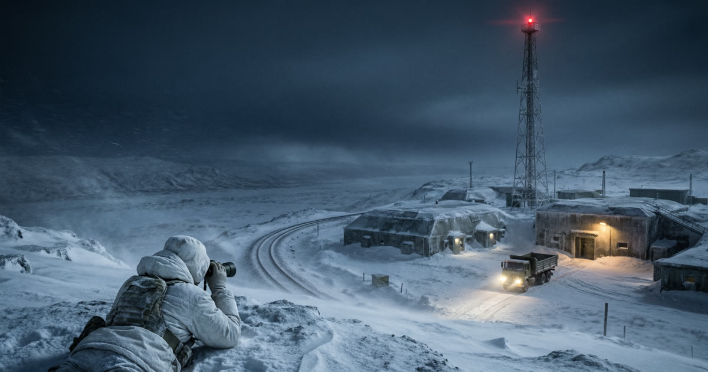
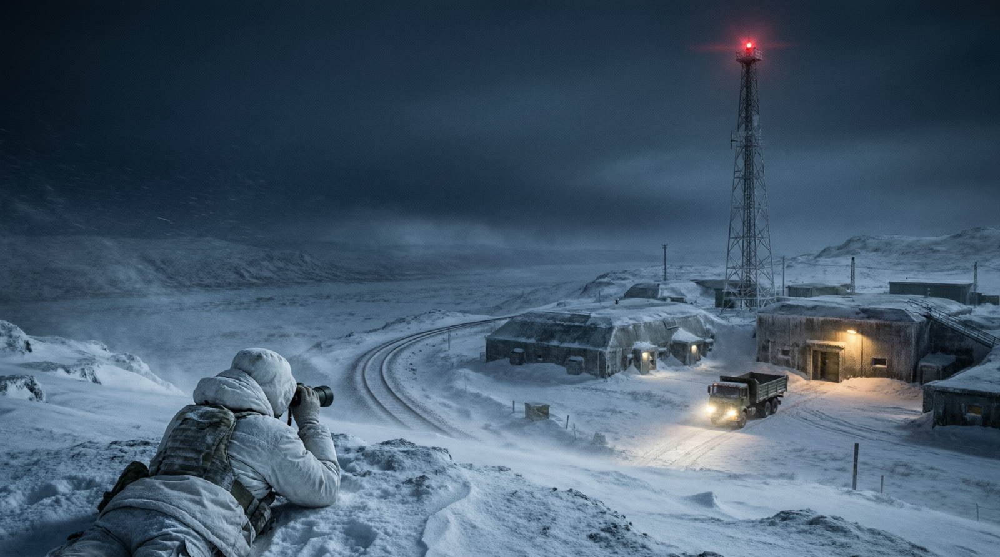
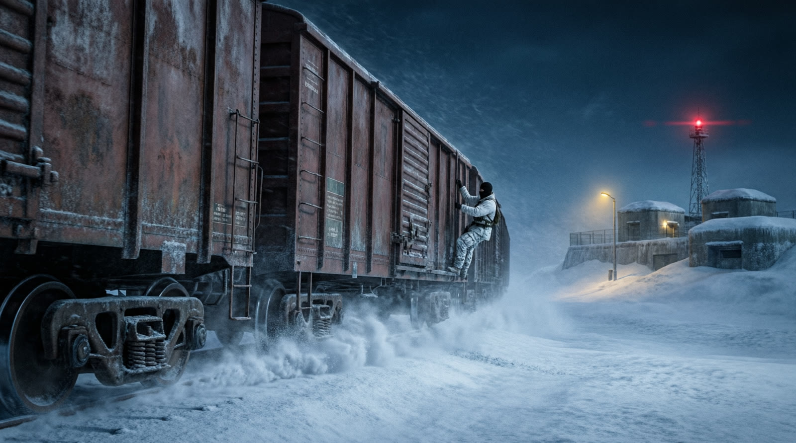
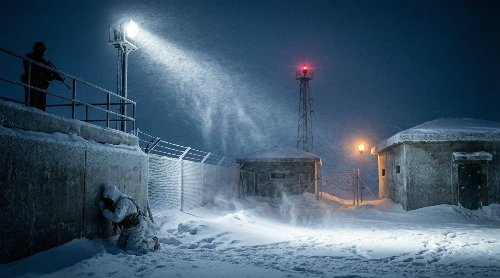
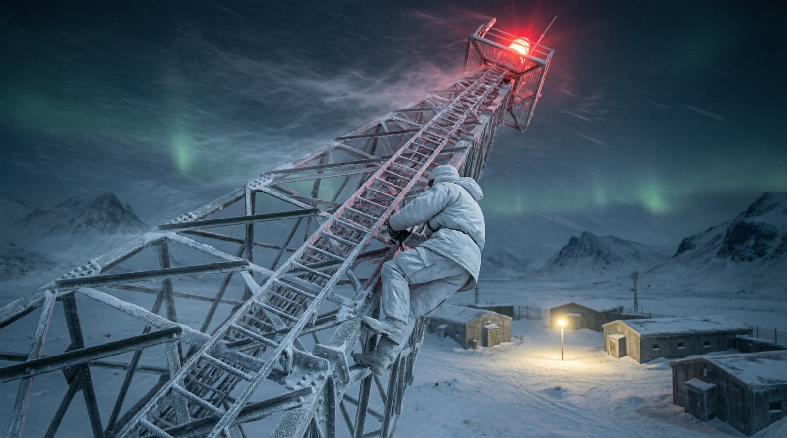
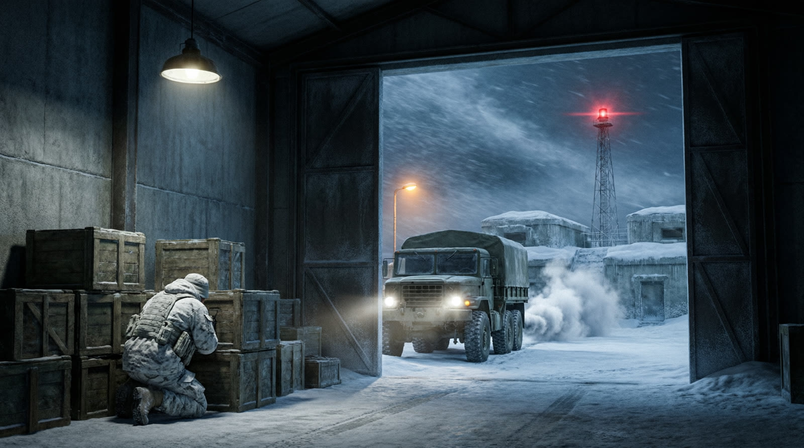

<b>Русский</b> · <a href="README.en.md">English</a>

  

<h1 align="center">SnowOps</h1>

Тактический стелс-шутер для телефона и ПК. База за Полярным кругом. Один оперативник. Никто не должен узнать, что ты здесь был.

  
  
  
  
  

---

## Что это

SnowOps — одиночная кампания про оперативника, которого высаживают у полярной военной базы с одним заданием: пройти внутрь, сделать дело и исчезнуть до рассвета.

Здесь нет укрытий с регенерацией и стрелочки к цели. Есть бинокль, карта, патрули по расписанию и много снега, на котором тебя хорошо видно. Как в шутерах конца девяностых, только на экране телефона. Игра работает полностью офлайн: без интернета, аккаунтов, рекламы и покупок.

## Скачать тестовую сборку

Игра в **альфе**: может падать, тормозить и удивлять. Именно поэтому нужны тестеры. Все сборки лежат в [релизах этого репозитория](https://github.com/Romaxa55/snowops-site/releases/latest), контрольные суммы в `SHA256SUMS`.

| Платформа | Файл | Как запустить |
|---|---|---|
| Android 8.0+, arm64 | `SnowOps-vX-android-arm64.apk` | Разрешить установку из неизвестных источников, открыть APK |
| Windows 10/11, x86_64 | `SnowOps-vX-windows-x86_64.zip` | Распаковать, запустить `SnowOps.exe` |
| Linux, x86_64 и arm64 | `SnowOps-vX-linux.tar.gz` | `tar xzf`, запустить `SnowOps.x86_64` или `SnowOps.arm64`, общий `SnowOps.pck` рядом |
| macOS 11+, universal | `SnowOps-vX-macos-universal.zip` | Правый клик → Открыть, либо `xattr -dr com.apple.quarantine SnowOps.app` |

Сборка без нотаризации Apple и без страниц в магазинах: это тестовый этап. Когда игра выйдет в Google Play, App Store и RuStore, ссылки появятся на [сайте](https://romaxa55.github.io/snowops-site/#download).

## Кадры

<table>
  <tr>
    <td></td>
    <td></td>
  </tr>
  <tr>
    <td><em>Разведка с гребня. База внизу, до смены караула двенадцать минут.</em></td>
    <td><em>Товарный состав идёт к базе. Лучший способ попасть внутрь без пропуска.</em></td>
  </tr>
  <tr>
    <td></td>
    <td></td>
  </tr>
  <tr>
    <td><em>Периметр. Прожектор возвращается каждые восемь секунд.</em></td>
    <td><em>Радиовышка. Пока горит красный, связь у них есть.</em></td>
  </tr>
</table>

 <em>Гараж. Грузовик уходит через минуту, с тобой или без.</em>

## Что здесь есть

- **Патрули ходят по маршрутам.** Охрана обходит периметр по расписанию, камеры поворачиваются, прожекторы ищут в темноте. Запомни ритм, найди дыру и проскользни. Или подними тревогу и разбирайся с последствиями.
- **База живёт без тебя.** Товарные составы идут по расписанию, грузовик выезжает из гаража, караул меняется по часам. Любое из этого можно использовать как прикрытие.
- **Бинокль важнее автомата.** Открытые пространства и дальние дистанции. Сначала рассмотри, потом планируй, потом стреляй, если без этого не обойтись.
- **Сделано под телефон.** Крупные кнопки, раскладка под большие пальцы, короткие сессии. Игра не просит интернета, аккаунта и лишних разрешений.

## Статус и планы

| Сейчас | Дальше |
|---|---|
| Альфа, русский язык, один уровень для прохождения | Английская версия, собственные модели и уровни, выход в Google Play, App Store и RuStore, затем Steam |

Игра делается на [Godot 4.7](https://godotengine.org). Сборки собираются автоматически из приватного репозитория с кодом по релизному тегу и публикуются сюда.

## Сайт и документы

- Сайт: <https://romaxa55.github.io/snowops-site/>
- [Политика конфиденциальности](https://romaxa55.github.io/snowops-site/privacy.html) · [Пользовательское соглашение](https://romaxa55.github.io/snowops-site/terms.html) · [Удаление данных](https://romaxa55.github.io/snowops-site/data-deletion.html) · [Поддержка](https://romaxa55.github.io/snowops-site/support.html)

Этот репозиторий — исходники сайта (статический HTML, без сборки) и площадка для релизов. Код самой игры здесь не публикуется.

## Обратная связь

Нашли ошибку, игра не запускается или есть идея: [Issues](https://github.com/Romaxa55/snowops-site/issues) или письмо на <support@snowops.game>. Укажите модель устройства, версию системы и версию игры из названия файла.

---

© 2026 SnowOps. Все права на игру, её название и материалы принадлежат разработчику. Google Play, App Store и RuStore являются товарными знаками их правообладателей.

