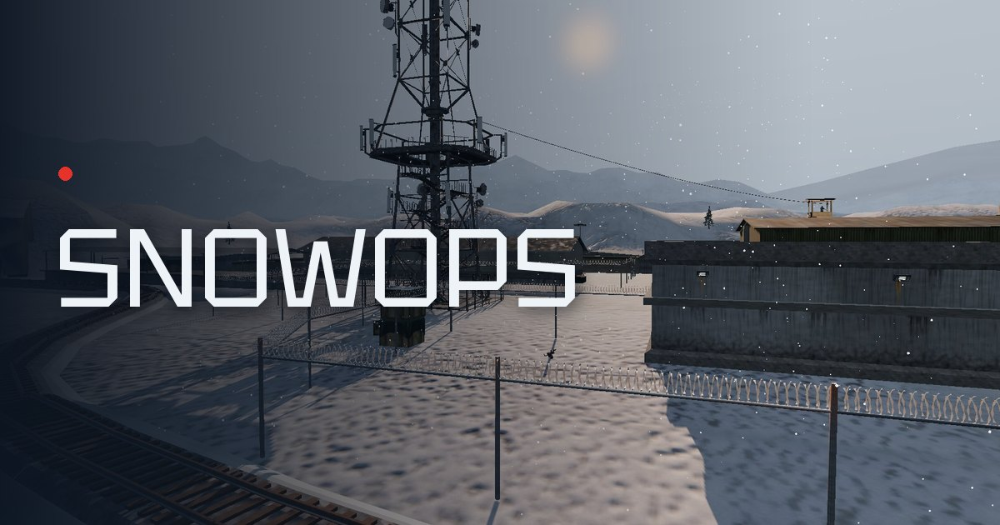
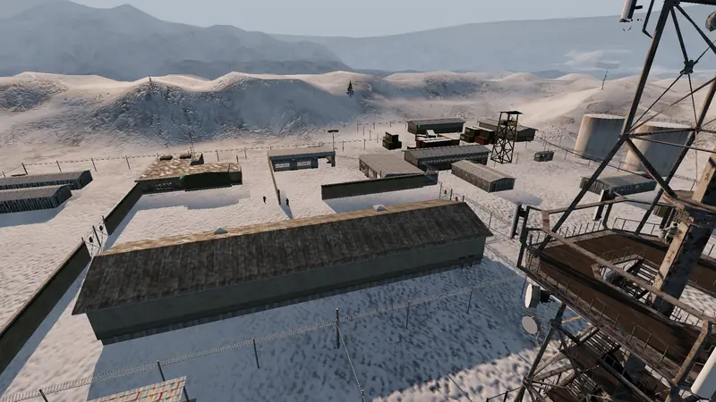
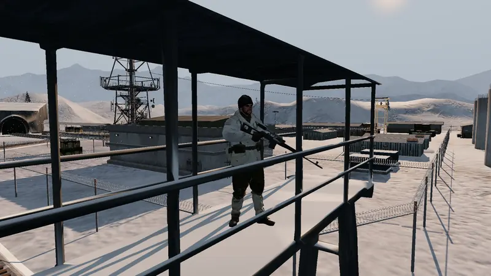
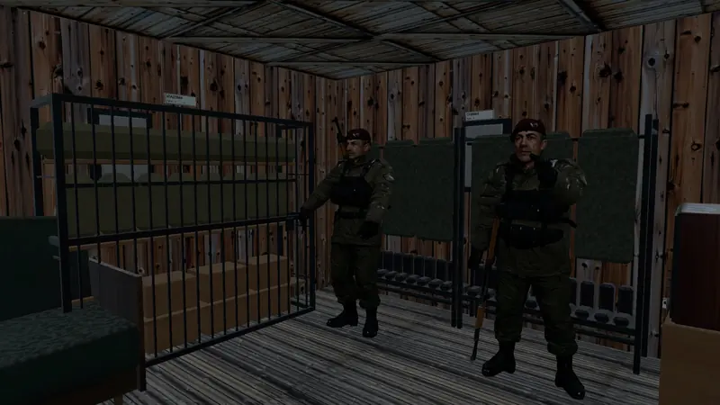
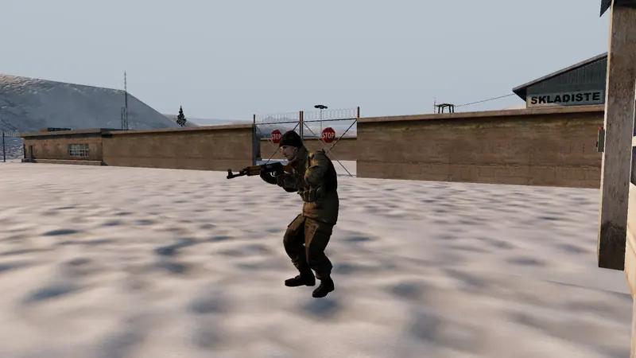
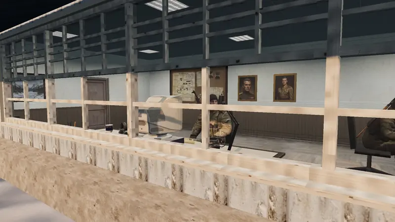
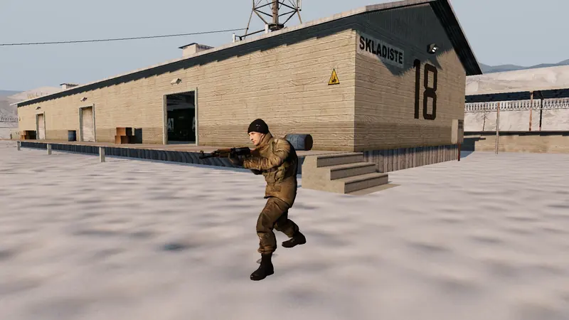

<b>Русский</b> · <a href="README.en.md">English</a>

  

<h1 align="center">SnowOps</h1>

Тактический стелс-шутер для телефона и ПК. База за Полярным кругом. Один оперативник. Никто не должен узнать, что ты здесь был.

  
  
  
  
  

---

## Что это

SnowOps — одиночная миссия на заснеженной военной базе за Полярным кругом. Тебя сбрасывают с вертолёта на крышу идущего поезда, дальше — сам: через забор, мимо вышек и патрулей — к грузовику у главного входа.

Здесь нет стрелки к цели и здоровья, которое восстанавливается за укрытием. Есть глаза охраны, которые надо обмануть, и тишина, которую легко нарушить одним выстрелом. Тридцать шесть человек охраны живут по уставу: меняют посты, докладывают по рации, ищут пропавших. Игра работает полностью офлайн: без интернета, аккаунтов, рекламы и покупок.

## Скачать тестовую сборку

Игра в **альфе**: может падать, тормозить и удивлять. Именно поэтому нужны тестеры. Все сборки лежат в [релизах этого репозитория](https://github.com/Romaxa55/snowops-site/releases/latest), контрольные суммы в `SHA256SUMS`.

| Платформа | Файл | Как запустить |
|---|---|---|
| Android 8.0+, arm64 | `SnowOps-vX-android-arm64.apk` | Разрешить установку из неизвестных источников, открыть APK |
| Windows 10/11, x86_64 | `SnowOps-vX-windows-x86_64-setup.exe` или `…-windows-x86_64.zip` | Установщик — обычная установка; архив — переносная версия: распаковать, запустить `SnowOps.exe` |
| Linux, x86_64 и arm64 | `SnowOps-vX-linux.tar.gz` | `tar xzf`, запустить `SnowOps.x86_64` или `SnowOps.arm64`, общий `SnowOps.pck` рядом |
| macOS 11+, universal | `SnowOps-vX-macos-universal.zip` | Правый клик → Открыть, либо `xattr -dr com.apple.quarantine SnowOps.app` |

Сборка без нотаризации Apple и без страниц в магазинах: это тестовый этап. Когда игра выйдет в Google Play, App Store и RuStore, ссылки появятся на [сайте](https://romaxa55.github.io/snowops-site/#download).

## Кадры

Всё снято в игре, без доработки.

<table>
  <tr>
    <td></td>
    <td></td>
  </tr>
  <tr>
    <td><em>База сверху. Ангары, вышки, цистерны.</em></td>
    <td><em>Снайпер над железной дорогой. Сначала его.</em></td>
  </tr>
  <tr>
    <td></td>
    <td></td>
  </tr>
  <tr>
    <td><em>Оружейная. Двое у решётки.</em></td>
    <td><em>Патруль у КПП.</em></td>
  </tr>
  <tr>
    <td></td>
    <td></td>
  </tr>
  <tr>
    <td><em>Штаб. Офицер за столом, портреты на стене.</em></td>
    <td><em>Склад 18. Патруль ходит своим маршрутом — запомни его.</em></td>
  </tr>
</table>

## Что здесь есть

- **Охрана сомневается.** Часовой не стреляет с первого взгляда. Сначала «?» — остановится, всмотрится, пойдёт проверить. В темноте, лёжа и без движения тебя узнают дольше.
- **База живёт по уставу.** Посты меняются, дневальный на своём месте, офицер обходит здания. Часовой сначала окликнет: «Стой, назад!» — и только потом откроет огонь.
- **Пост молчит — хватятся.** «Всем постам — доложить обстановку». Убрал часового — его вызовут ещё раз, потом: «Пост не отвечает. Проверить!» Найдут тело — тревога.
- **Свет и темнота.** Выстрел в щиток гасит всё здание, в комнатах — обычные выключатели. В темноте тебя замечают позже, но хлопок услышат.
- **Трос — тихий путь.** С радиовышки через базу тянется трос: издалека охрана примет тебя за тень. Пока не воет сирена.
- **Потеряли — ищут.** Ищут там, где видели в последний раз, заглядывают за угол и в комнаты. Под сиреной вся база по рации знает, где тебя заметили.
- **И ещё:** камеры поднимают тревогу за три секунды; следы на снегу и пар изо рта на морозе; СВД с оптикой, MP5 с глушителем, гранаты; сенсорное управление под большие пальцы.

## Статус и планы

| Сейчас | Дальше |
|---|---|
| Альфа, русский язык, один уровень для прохождения | Английская версия, собственные модели и уровни, выход в Google Play, App Store и RuStore, затем Steam |

Игра делается на [Godot 4.7](https://godotengine.org). Сборки собираются автоматически из приватного репозитория с кодом по релизному тегу и публикуются сюда.

## Сайт и документы

- Сайт: <https://romaxa55.github.io/snowops-site/>
- [Политика конфиденциальности](https://romaxa55.github.io/snowops-site/privacy.html) · [Пользовательское соглашение](https://romaxa55.github.io/snowops-site/terms.html) · [Удаление данных](https://romaxa55.github.io/snowops-site/data-deletion.html) · [Поддержка](https://romaxa55.github.io/snowops-site/support.html)

Этот репозиторий — исходники сайта (статический HTML, без сборки) и площадка для релизов. Код самой игры здесь не публикуется.

## Обратная связь

Нашли ошибку, игра не запускается или есть идея: [Issues](https://github.com/Romaxa55/snowops-site/issues) или письмо на <support@snowops.game>. Укажите модель устройства, версию системы и версию игры из названия файла.

---

© 2026 SnowOps. Все права на игру, её название и материалы принадлежат разработчику. Google Play, App Store и RuStore являются товарными знаками их правообладателей.

